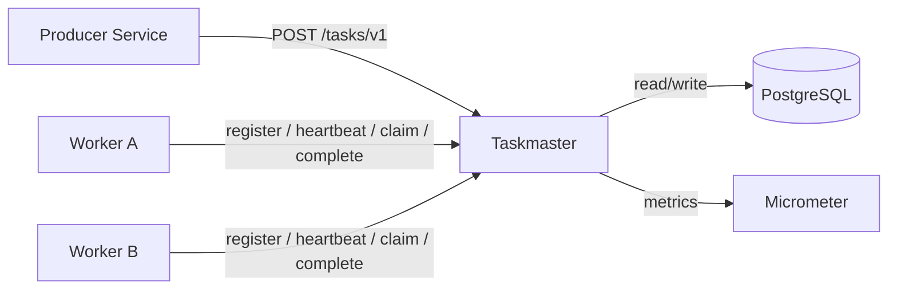
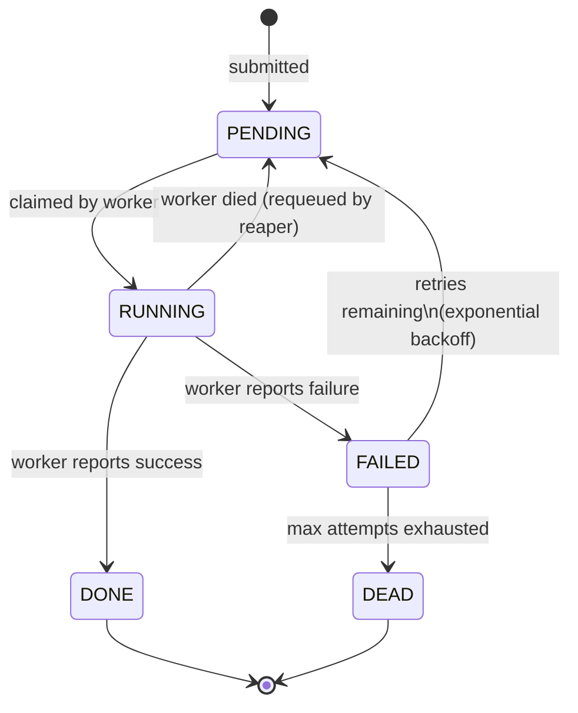
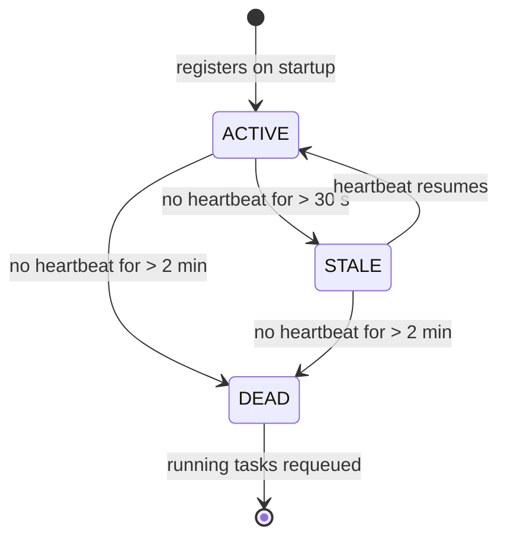
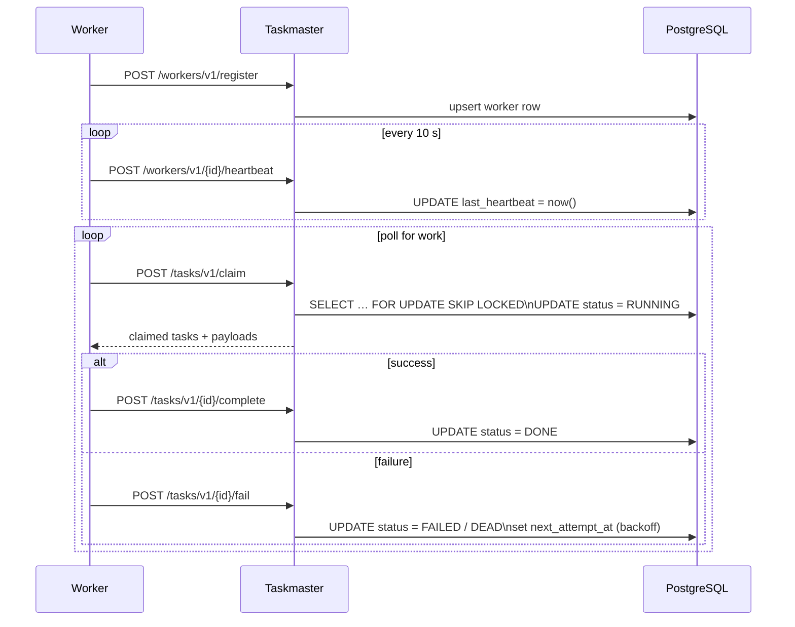

# Taskmaster

A generic **task coordination service** — a durable task queue with worker liveness tracking. Works over a PostgreSQL database. Microservices submit tasks via REST; separate worker processes poll to claim and execute them. Taskmaster owns no business logic: it tracks state, enforces exclusive ownership, and handles retries.

---

## Architecture



Producers and workers are completely decoupled — they only talk to Taskmaster over HTTP. Workers are stateless and horizontally scalable.

---

## Task lifecycle



Tasks carry a **priority** (higher = claimed first) and a configurable **max attempts** before being permanently dead-lettered. Failed tasks are retried with exponential backoff capped at 5 minutes.

---

## Worker lifecycle



Workers send a heartbeat every 10 seconds. A background reaper sweeps every 15 seconds, demoting silent workers and requeuing any tasks they were holding.

---

## Claim flow



Claiming is atomic (`FOR UPDATE SKIP LOCKED`) — two workers polling simultaneously will never receive the same task.

---

## Background jobs

| Job | Interval | Responsibility |
|---|---|---|
| **Heartbeat Reaper** | 15 s | Marks silent workers STALE → DEAD; requeues their tasks |
| **Deadline Reaper** | 30 s | Moves PENDING tasks past their deadline to DEAD |

---

## API surface

| Method | Path | Description |
|---|---|---|
| `POST` | `/tasks/v1` | Submit a new task |
| `GET` | `/tasks/v1/{id}` | Fetch task status |
| `GET` | `/tasks/v1` | List tasks (filterable by queue, status, limit) |
| `POST` | `/tasks/v1/claim` | Atomically claim up to N tasks |
| `POST` | `/tasks/v1/{id}/complete` | Mark a task done |
| `POST` | `/tasks/v1/{id}/fail` | Report failure; triggers retry or dead-letter |
| `POST` | `/workers/v1/register` | Register a worker (idempotent) |
| `POST` | `/workers/v1/{id}/heartbeat` | Refresh worker liveness |
| `GET` | `/workers/v1` | List all workers |
| `GET` | `/queues/v1` | Per-queue task counts and active worker count |

All error responses follow [RFC 9457 Problem Details](https://www.rfc-editor.org/rfc/rfc9457).

---

## Configuration

| Property | Default | Description |
|---|---|---|
| `taskmaster.heartbeat.stale-threshold-seconds` | `30` | Seconds of silence before a worker is marked STALE |
| `taskmaster.heartbeat.dead-threshold-seconds` | `120` | Seconds of silence before a worker is marked DEAD |
| `taskmaster.reaper.interval-ms` | `15000` | How often the heartbeat reaper runs |

---

## Metrics

Taskmaster exposes Prometheus metrics via `/actuator/prometheus`. All task metrics are tagged with `queue` for per-queue filtering.

### Counters

| Metric | Tags | Description |
|---|---|---|
| `tasks.submitted` | `queue` | Tasks submitted |
| `tasks.claimed` | `queue` | Tasks claimed by workers |
| `tasks.completed` | `queue` | Tasks completed successfully |
| `tasks.failed` | `queue` | Task failures (before retry decision) |
| `tasks.dead_lettered` | `queue`, `reason` | Tasks moved to terminal DEAD state (`exhausted`, `worker_dead`, `deadline`) |
| `tasks.requeued` | `reason` | Tasks returned to PENDING for retry |
| `workers.registered` | `queue` | Worker registrations |
| `workers.died` | — | Workers marked DEAD |

### Timers

| Metric | Tags | Description |
|---|---|---|
| `tasks.queue.wait` | `queue` | Time from submission to claim (claimedAt − createdAt) |
| `tasks.execution.duration` | `queue` | Time from claim to completion/failure (finishedAt − claimedAt) |
| `tasks.end_to_end.duration` | `queue` | Total time from submission to terminal state, including retries |

---

## Docker

```bash
# Start everything (Taskmaster, PostgreSQL, Prometheus, Grafana)
docker compose up --build

# Taskmaster API:   http://localhost:8080
# Prometheus:       http://localhost:9090
# Grafana:          http://localhost:3000  (admin / admin)
```

A pre-provisioned Grafana dashboard ("Taskmaster Overview") is available on startup with panels for task throughput, dead letters, worker events, and latency breakdowns.
